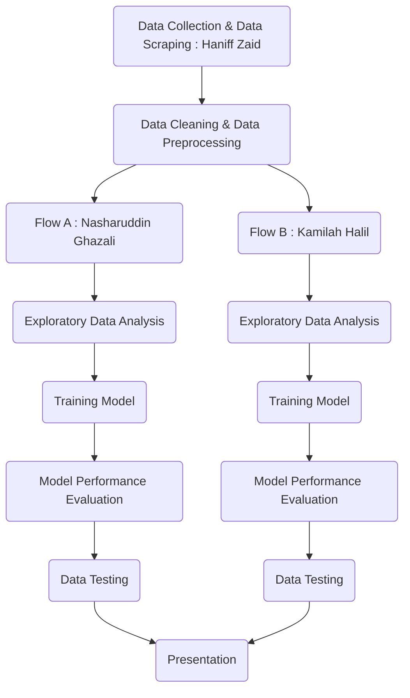
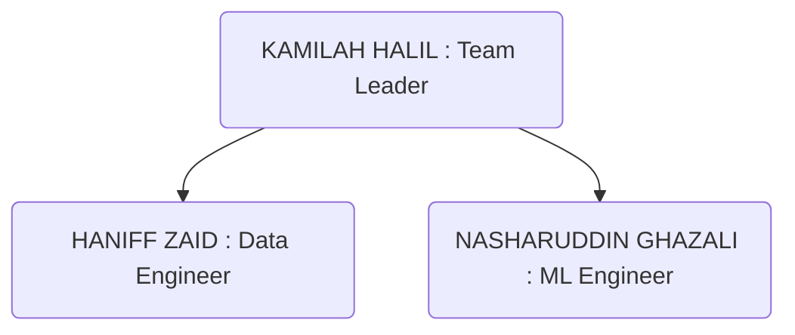

=======
<a name="readme-top"></a>

  <h1 align="center"><a href="https://github.com/HaniffZaid/KoNoHa-Property.git">
    
  </a>

  HOUSE PRICE PREDICTION IN KUALA LUMPUR</h1>
   <h2><p align="center">
     Produced by KONOHA HOLDINGS
   <p align="center">[ Kamilah Halil, Nasharuddin Ghazali & Haniff Zaid ]</p>
   </p></h2>

  <!-- TABLE OF CONTENTS -->
<details>
  <summary>Table of Contents</summary>
  <ol>
    <li><a href="#background-of-the-project">Background of the Project</a>
      <ul>
        <li><a href="#methodology">Methodology</a></li>
        <li><a href="#project-location">Project Location</a></li>
        <li><a href="#project-flowchart">Project Flowchart</a></li>
      </ul>
    </li>
    <li><a href="#phase-1-planning">PHASE 1 : PLANNING</a>
      <ul>
        <li><a href="#1-define-goals">1. Define Goals</a></li>
        <li><a href="#2-organize-resources">2. Organize Resources</a></li>
        <li><a href="#3-coordinate-team">3. Coordinate Team</a></li>
        <li><a href="#4-schedule-project">4. Schedule Project</a></li>
      </ul>
    </li>
    <li><a href="#phase-2-data-preparation">PHASE 2 : DATA PREPARATION</a>
      <ul>
        <li><a href="#5-get-data">5. Get Data</a></li>
        <li><a href="#6-clean-data">6. Clean Data</a></li>
        <li><a href="#7-explore-data">7. Explore Data</a></li>
        <li><a href="#8-refine-data">8. Refine Data</a></li>
      </ul>
    </li>
    <li><a href="#phase-3-ml-modelling">PHASE 3 : ML MODELLING</a>
      <ul>
        <li><a href="#9-create-model">9. Create Model</a></li>
        <li><a href="#10-validate-model">10. Validate Model</a></li>
        <li><a href="#11-evaluate-model">11. Evaluate Model</a></li>
        <li><a href="#12-refine-model">12. Refine Model</a></li>
      </ul>
    </li>
    <li><a href="#phase-4-deployment">PHASE 4 : DEPLOYMENT</a>
      <ul>
        <li><a href="#13-present-model">13. Present Model</a></li>
        <li><a href="#14-future-improvements--applications">14. Future Improvements & Applications</a></li>
      </ul>
    </li>
    <li><a href="#contact">Contact</a></li>
    <li><a href="#acknowledgement">Acknowledgement</a></li>
  </ol>
</details>


<!-- BACKGROUND OF THE PROJECT -->
## Background of The Project

KONOHA Holdings has been tasked to produce a house price prediction model within a week. After some quick research, we decided to focus on datasets available in Federal Territory of Kuala Lumpur (KL). House price prediction model is expected to **HELP BUYERS** i.e. people who plan to buy a house so they can know the price range in the future, then they can plan their finance well. In addition, house price predictions is also beneficial to **HELP SELLERS** i.e. property investors to know the trend of housing prices in a certain location.

<!-- METHODOLOGY -->
### Methodology

We divide the methodologies into four phases which are:

| Phase 1: PLANNING | Phase 2: DATA PREPARATION | Phase 3: ML MODELLING | Phase 4: DEPLOYMENT |
| ------------- | ------------- | ------------- | ------------- |
| 1. Define goals | 5. Get data | 9. Create model | 13. Present Model |
| 2. Organize resources | 6. Clean data | 10. Validate model | 14. Deploy model |
| 3. Coordinate team | 7. Explore data | 11. Evaluate model | 15. Modify model |
| 4. Schedule project | 8. Refine data | 12. Refine model | 16. Model maintenance |

However, we can only proceed until Step 13 for this bootcamp group presentation. From Step 14 onwards, we combine them are for Future Improvements & Applications.   

<!-- PROJECT LOCATION -->
### Project Location

```geojson
{
  "type": "FeatureCollection",
  "features": [
    {
      "type": "Feature",
      "properties": {},
      "geometry": {
        "coordinates": [
          [
            [
              101.61866004946938,
              3.2256216237932307
            ],
            [
              101.61866004946938,
              3.101070592555459
            ],
            [
              101.78437953118771,
              3.101070592555459
            ],
            [
              101.78437953118771,
              3.2256216237932307
            ],
            [
              101.61866004946938,
              3.2256216237932307
            ]
          ]
        ],
        "type": "Polygon"
      }
    }
  ]
}
```
<p align="center">Federal Territory of Kuala Lumpur (KL)</p>

<!-- FLOWCHART -->
### Project Flowchart


<p align="right">(<a href="#readme-top">back to top</a>)</p>


<!-- PLANNING PHASE -->
## **PHASE 1: PLANNING**

<!-- DEFINE GOALS -->
### 1. Define Goals

The goals is to HELP BUYERS i.e. people who plan to buy a house so they can know the price range in the future, then they can plan their finance well. In addition, house price predictions is also beneficial to HELP SELLERS i.e. property investors to know the trend of housing prices in a certain location around KL.

The **PROBLEM STATEMENTS & OBJECTIVES** are as follows:

1. **Predicting House Prices**:
   - *Problem Statement:* "Given a dataset with various features of houses (such as size, location, number of bedrooms, etc.), predict the selling price of a house."
   - *Objective:* Develop a predictive model that accurately estimates house prices based on input features.

2. **Feature Importance Analysis**:
   - *Problem Statement:* "Determine which features (e.g., number of bedrooms, location, square footage) are the most influential in predicting house prices."
   - *Objective:* Identify and rank the importance of different features to understand what drives house prices.

3. **Price Estimation for Different Locations**:
   - *Problem Statement:* "Estimate house prices for properties in different geographical areas, taking into account varying market conditions and local characteristics."
   - *Objective:* Create a model that can account for regional differences in housing prices and provide accurate estimates for various locations.

4. **Handling Missing Data**:
   - *Problem Statement:* "Address and handle missing or incomplete data in the housing dataset to improve the accuracy of the price prediction model."
   - *Objective:* Implement strategies to manage missing values and ensure that the model can still make reliable predictions.

5. **Model Comparison**:
   - *Problem Statement:* "Compare the performance of different regression algorithms (e.g., linear regression, decision trees, random forests) in predicting house prices."
   - *Objective:* Evaluate and compare the effectiveness of various machine learning models to identify the best-performing approach for price prediction.

6. **Addressing Outliers**:
   - *Problem Statement:* "Identify and manage outliers in the housing dataset that may distort the predictions of house prices."
   - *Objective:* Develop methods to detect and handle outliers to improve the accuracy and robustness of the predictive model.

<p align="right">(<a href="#readme-top">back to top</a>)</p>


<!-- ORGANIZE RESOURCES -->
### 2. Organize Resources

We have been tasked to predict the sales price for houses in Malaysia includes Condominium, Landed in various places. Datasets can be used:
1. [Malaysian condominium prices data](https://www.kaggle.com/datasets/mcpenguin/raw-malaysian-housing-prices-data)
2. [Property listings in Kuala Lumpur](https://www.kaggle.com/datasets/dragonduck/property-listings-in-kuala-lumpur)

After studying both datasets and some other datasets on internet, we decided to choose the **Property listings in Kuala Lumpur** dataset because it only focus specifically in Federal Territory of Kuala Lumpur. The other one is datasets with much bigger scale so it will take much more time to develop the prediction model.

<p align="right">(<a href="#readme-top">back to top</a>)</p>


<!-- COORDINATE TEAM -->
### 3. Coordinate Team

Team Structure


<p align="right">(<a href="#readme-top">back to top</a>)</p>


<!-- SCHEDULE -->
### 4. Schedule Project

|  | DAY 1 | DAY 2 | DAY 3 | DAY 4 | DAY 5 | DAY 6 | DAY 7 | DAY 8 |
| ------------- | ------------- | ------------- | ------------- | ------------- | ------------- | ------------- | ------------- | ------------- |
| ITEMS | 17/08/24 | 18/08/24 | 19/08/24 | 20/08/24 | 21/08/24 | 22/08/24 | 23/08/24 | 24/08/24 | 
| Data Collection and Scraping | H | 
| Data Cleaning and Preprocessing |  | H | H |
| Exploratory Data Analysis |  |  |  | KN |
| ML Data Modelling |  |  |  |  | KN |
| Model Performance Evaluation |  |  |  |  |  | KNH | KNH |
| Presentation |  |  |  |  |  |  |  | KNH |

K = Kamilah Halil, N = Nasharuddin Ghazali, H = Haniff Zaid

<p align="right">(<a href="#readme-top">back to top</a>)</p>


<!-- DATA PREPARATION -->
## **PHASE 2: DATA PREPARATION**

### 5. Get Data

This project were written in Google Colaboratory. Firstly, we downloaded  `data_kaggle.csv` datasets from [Kaggle](https://www.kaggle.com/datasets/dragonduck/property-listings-in-kuala-lumpur), and mount it into Google Drive. Then following Python libraries were installed:

  ```sh
  import pandas as pd
  import re
  import matplotlib.pyplot as plt
  import seaborn as sns
  import numpy as np
  import sklearn.preprocessing.LabelEncoder
  import sklearn.model_selection
  import sklearn.linear_model
  import sklearn.feature_selection
  import sklearn.metrics
  ```

### 6. Clean Data

We started data cleaning by:
  1. Display summary statistics
  2. Check for missing values
  3. Based on the statistics, we decided to drop the `Car Parks` column because it comprises of 31% of overall data.
  4. Then we trasform the data by columns
     - `Location`: Strip the Kuala Lumpur words
     - `Price`: Extract only numerical value
     - `Rooms`: Split the value into Rooms and Store
     - `Property Type`: Standardize the type
     - `Size`: Select only the numerical value
  5. Create new column comprises `Price/Sqft` for further ML model prediction process

### 7. Explore Data

We use `sklearn.preprocessing.LabelEncoder` to transforms categorical variables into numerical values

### 8. Refine Data

We detected outliers using `Z-score` and `IQR` methods. Then we remove extreme outliers.

<p align="right">(<a href="#readme-top">back to top</a>)</p>


<!-- ML MODELLING -->
## **PHASE 3: ML MODELLING**

### 9. Create Model

We tried a few regression models to train and test the cleaned datasets, which are:
  - `Linear Regression`
  - `Random Forest`
  - `XGBoost`
  - `Decision Trees`

### 10. Validate Model

We assessed how well the model performs on unseen data and ensured it generalizes well. This is by split the dataset into `training` and `test` sets.

### 11. Evaluate Model

We performed model evaluation to assess the performance of all regression model by calculating several key metrics which are:
  - `Mean Squared Error (MSE)`
  - `Root Mean Squared Error (RMSE)`
  - `Mean Absolute Error (MAE)`
  - `R-squared (R²) score`

### 12. Refine Model

We performed comparison between Model Predictions and Actual Values


<p align="right">(<a href="#readme-top">back to top</a>)</p>


<!-- DEPLOYMENT -->
## **PHASE 4: DEPLOYMENT**

<!-- PRESENT MODEL -->
### 13. Present Model

<!-- FUTURE IMPROVEMENTS & APPLICATIONS -->
### 14. Future Improvements & Applications

Improving house price prediction models with machine learning is an ongoing area of research and development. We suggest some promising future improvements:

1. **Feature Engineering and Selection**:
   - **More Granular Features**: Incorporating detailed features such as neighborhood amenities, local school ratings, or future infrastructure plans.
   - **Temporal Features**: Integrating time-based features to capture trends and seasonal variations in the housing market.
   - **Interaction Terms**: Exploring interactions between different features to capture complex relationships.

2. **Data Quality and Quantity**:
   - **Enhanced Data Collection**: Using more comprehensive datasets, including satellite imagery, social media sentiment, and economic indicators.
   - **Data Augmentation**: Leveraging synthetic data or data from related domains to improve model robustness.
   - **Better Data Cleaning**: Improving preprocessing techniques to handle missing values, outliers, and data inconsistencies.

3. **Advanced Model Architectures**:
   - **Ensemble Methods**: Combining multiple models (e.g., gradient boosting, random forests) to improve prediction accuracy.
   - **Deep Learning**: Employing neural networks, such as convolutional neural networks (CNNs) for spatial data or recurrent neural networks (RNNs) for temporal data.
   - **Hybrid Models**: Combining traditional statistical methods with machine learning techniques for better performance.

4. **Explainability and Interpretability**:
   - **Model Transparency**: Developing models that provide insights into how predictions are made, which helps in understanding and trust.
   - **Feature Importance**: Providing clear explanations of which features are driving the predictions.

8. **User Personalization**:
   - **Customized Recommendations**: Tailoring predictions based on user-specific preferences or past behavior.
   - **Interactive Tools**: Developing interfaces that allow users to explore different scenarios and their impacts on house prices.

Implementing these improvements requires a combination of better data, advanced modeling techniques, and ongoing evaluation to adapt to evolving market conditions.

<p align="right">(<a href="#readme-top">back to top</a>)</p>
_______________________________________________________________________________________________________

### **Hey Non-Coders, You Can Contribute Too!**

- *STEP 1 --> Get the Big Picture*: Take a look at our project flow and get to know what’s happening behind the scenes. It’s all about understanding how the pieces fit together.
- *STEP 2 --> Data Wizardry*: You can help by working your magic on our datasets. Make sure they’re clean and ready to roll before passing them to the coders.
- *STEP 3 --> Spice Up the Docs*: If writing is your thing, help us make our documentation sparkle! Keep it clear, keep it fun, and make sure it’s up-to-date.
- *STEP 4 --> Tester Extraordinaire* : Run some tests, take notes, and let us know what you find. You don’t need to write code—just tell us what’s working and what’s not.
Stay in the Loop: Jump into our Google Drive, GitHub, and Trello boards, and keep the collaboration going. Your insights could be the key to cracking a tough problem!

> You’re a crucial part of this team, and we’re thrilled to have you on board!

<p align="right">(<a href="#readme-top">back to top</a>)</p>
_______________________________________________________________________________________________________

### **Found a Bug? Let’s Squash It Together!**

> First off, thanks for digging in and helping us out! If you’ve found a bug, here’s how we can team up to fix it:

- *STEP 1 --> Shout It Out!*: Open an issue on GitHub and give us the scoop. What’s going wrong? Got screenshots? Even better!
- *STEP 2 --> Got a Fix? Bring It On!*:  If you’ve got a bright idea for a fix, don’t be shy—share it in the issue. Or go full hero mode and submit a pull request.
- *STEP 3 --> Chat It Up*:  Let’s talk it out with other contributors and brainstorm the best solution. Your ideas could be the game-changer we need.
- *STEP 4 --> Test, Test, Test* :  If you’re dropping a fix, make sure to test it like a pro. We want to keep things running smoothly!

> Thanks a million for helping us keep this project in tip-top shape. Every little bit helps, and you’re awesome for contributing!

<p align="right">(<a href="#readme-top">back to top</a>)</p>
_______________________________________________________________________________________________________

### **Known Quirks & Quibbles**

**Quirk #1: Data Drama**

- *What’s Up* : Our data’s got a mind of its own—especially in the Location and Property Type columns. It’s a bit all over the place.
- *How to Handle It*: Before you run our scripts, give those columns a little TLC and make sure they’re consistent.
- *We’re On It* : We’re cooking up a script to handle this automatically, so stay tuned!

**Quirk #2: The Overfitting Fiasco**

- *What’s Up* : Our model sometimes gets a little too cozy with small datasets, which isn’t great for generalizing.
- *How to Handle It* : Try out cross-validation or sprinkle in some regularization to keep things on track.

> We’re On It: We’re exploring new methods to toughen up our model, so hang tight for improvements.
Check back here for updates—we’re always working on making things better!

<p align="right">(<a href="#readme-top">back to top</a>)</p>
_______________________________________________________________________________________________________

**Help Us Out: Donate to Make This Project Even Cooler!**

> Love what we’re doing? Want to see this project reach new heights? Here’s how you can help:

**Why Donate?**

- *Boost Accuracy* : Your support means we can grab better data and beef up our models to give you spot-on predictions.
- *Add Cool Stuff* : With your help, we can add snazzy new features like real-time predictions and more user-friendly tools.
- * Support Open Source*: Your donation keeps this project open and accessible for everyone. Go ahead, be a hero!

**How to Donate:**
Drop us some love on Paypal or buy us some coffee through this Touch n Go Qr Code.
Every little bit helps, and we’re super grateful for your support. Thanks for being awesome!
_______________________________________________________________________________________________________

<!-- CONTACT -->
## Contact

1. Kamilah Halil - [LinkedIn](https://www.linkedin.com/in/kamilah-abang-abdul-halil-2aa0b6203) - [Github](https://github.com/kameerahariru) - [Gmail](mailto:harirukamira@gmail.com)

2. Nasharuddin Ghazali - [LinkedIn](https://www.linkedin.com/in/muhd-ghazali-4432ba1b4/) - [Github](https://github.com/Nash887) - [Gmail](mailto:nasharuddin.ghazali@gmail.com)

3. Haniff Zaid - [LinkedIn](https://www.linkedin.com/in/HaniffZaid) - [Github](https://github.com/HaniffZaid) - [Gmail](mailto:anipzaid@gmail.com)

   - Project link: [Github](https://github.com/kameerahariru/KoNoHa-Property.git)
   - Project slide presentation: [Google Slides](https://docs.google.com/presentation/d/1ll2SgYuS_S0OPC4TqHXadhiGL1vdAtEBrYCxVSpnGMA/edit?usp=sharing)

<p align="right">(<a href="#readme-top">back to top</a>)</p>

_______________________________________________________________________________________________________
<!-- ACKNOWLEDGEMENT -->
## Acknowledgement

We want to express our appreciation to our Data Science Bootcamp trainer, Dr. Fairoza Amira Binti Hamzah, for all the knowledge she has taught us from the start till the end of the bootcamp. We hope to gain much more knowledge by joining her team in the future. May Allah bless her with success, health, happiness, patience and strength, amin.

Dr. Fairoza Amira - [LinkedIn](https://www.linkedin.com/in/fairoza-amira-binti-hamzah) - [Github](https://github.com/FairozaAmira) - [Gmail](mailto:fairozaamira@gmail.com)

<p align="right">(<a href="#readme-top">back to top</a>)</p>
