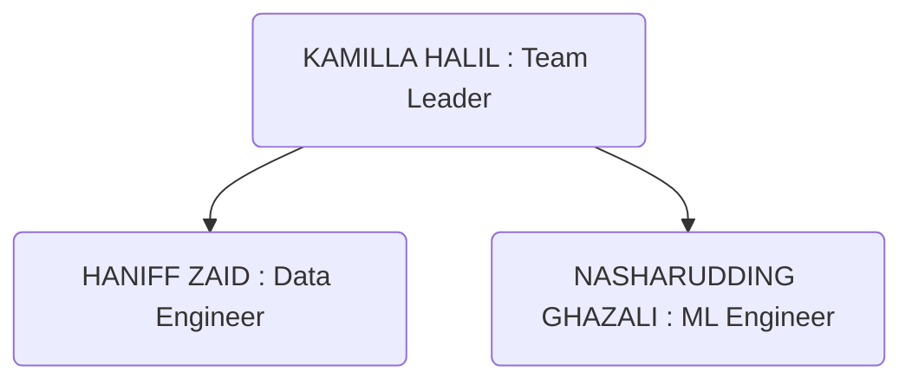

<a name="readme-top"></a>

  <h1 align="center"><a href="https://github.com/HaniffZaid/KoNoHa-Property.git">
    
  </a>

  HOUSE PRICE PREDICTION IN KUALA LUMPUR</h1>
   <h2><p align="center">
     Produced by KONOHA HOLDINGS
   <p align="center">[ Kamilla Halil, Nasharuddin Ghazali & Haniff Zaid ]</p>
   </p></h2>

  <!-- TABLE OF CONTENTS -->
<details>
  <summary>Table of Contents</summary>
  <ol>
    <li><a href="#background-of-the-project">Background of the Project</a></li>
    <li><a href="#team-structure">Team Structure</a></li>
    <li><a href="#problem-statement-objectives">Problem Statement & Objectives</a></li>
    <li><a href="#contact">Contact</a></li>
    <li><a href="#acknowledgement">Acknowledgement</a></li>
  </ol>
</details>


<!-- Background of The Projects -->
## Background of The Project

KONOHA Holdings has been tasked to produce a house price prediction model. After some research, we decided to focus dataset available in Kuala Lumpur city. House price prediction model are expected to HELP BUYERS i.e. people who plan to buy a house so they can know the price range in the future, then they can plan their finance well. In addition, house price predictions are also beneficial for HELP SELLER i.e. property investors to know the trend of housing prices in a certain location.

We divide the SOPs into three phases which are:

| Phase 1 | Phase 2 | Phase 3 |
| ------------- | ------------- | ------------- |
| PLANNING | DATA PREPARATION | ML MODELLING |
| ------------- | ------------- | ------------- |
| 1.Define goals | 5. Get data | 9. Create model |
| 2. Organize resources | 6. Clean data | 10. Validate model |
| 3. Coordinate team | 7. Explore data | 11. Evaluate model |
| 4. Schedule project | 8. Refine data | 12. Refine model |

<!-- Team Structure -->
## Team Structure


<p align="right">(<a href="#readme-top">back to top</a>)</p>

<!-- Problem Statement & Objectives -->
## Problem Statement & Objectives

In a house price prediction model project, the common problem statements typically revolve around understanding and predicting the value of residential properties based on various features. Here are some common problem statements you might encounter:

1. **Predicting House Prices**:
   - *Problem Statement:* "Given a dataset with various features of houses (such as size, location, number of bedrooms, etc.), predict the selling price of a house."
   - *Objective:* Develop a predictive model that accurately estimates house prices based on input features.

2. **Feature Importance Analysis**:
   - *Problem Statement:* "Determine which features (e.g., number of bedrooms, location, square footage) are the most influential in predicting house prices."
   - *Objective:* Identify and rank the importance of different features to understand what drives house prices.

3. **Price Estimation for Different Locations**:
   - *Problem Statement:* "Estimate house prices for properties in different geographical areas, taking into account varying market conditions and local characteristics."
   - *Objective:* Create a model that can account for regional differences in housing prices and provide accurate estimates for various locations.

4. **Handling Missing Data**:
   - *Problem Statement:* "Address and handle missing or incomplete data in the housing dataset to improve the accuracy of the price prediction model."
   - *Objective:* Implement strategies to manage missing values and ensure that the model can still make reliable predictions.

5. **Model Comparison**:
   - *Problem Statement:* "Compare the performance of different regression algorithms (e.g., linear regression, decision trees, random forests) in predicting house prices."
   - *Objective:* Evaluate and compare the effectiveness of various machine learning models to identify the best-performing approach for price prediction.

6. **Addressing Outliers**:
   - *Problem Statement:* "Identify and manage outliers in the housing dataset that may distort the predictions of house prices."
   - *Objective:* Develop methods to detect and handle outliers to improve the accuracy and robustness of the predictive model.

7. **Time Series Analysis for Price Trends**:
   - *Problem Statement:* "Analyze and predict trends in house prices over time, considering historical data to forecast future price movements."
   - *Objective:* Build a time series model to understand and predict how house prices change over time.

8. **Impact of Economic Factors**:
   - *Problem Statement:* "Assess the impact of economic factors (e.g., interest rates, unemployment rates) on house prices and incorporate these factors into the predictive model."
   - *Objective:* Integrate macroeconomic indicators into the model to enhance price predictions and account for broader economic influences.

<p align="right">(<a href="#readme-top">back to top</a>)</p>

## Project Location

```geojson
{
  "type": "FeatureCollection",
  "features": [
    {
      "type": "Feature",
      "properties": {},
      "geometry": {
        "coordinates": [
          [
            [
              101.61866004946938,
              3.2256216237932307
            ],
            [
              101.61866004946938,
              3.101070592555459
            ],
            [
              101.78437953118771,
              3.101070592555459
            ],
            [
              101.78437953118771,
              3.2256216237932307
            ],
            [
              101.61866004946938,
              3.2256216237932307
            ]
          ]
        ],
        "type": "Polygon"
      }
    }
  ]
}
```
<p align="right">(<a href="#readme-top">back to top</a>)</p>
