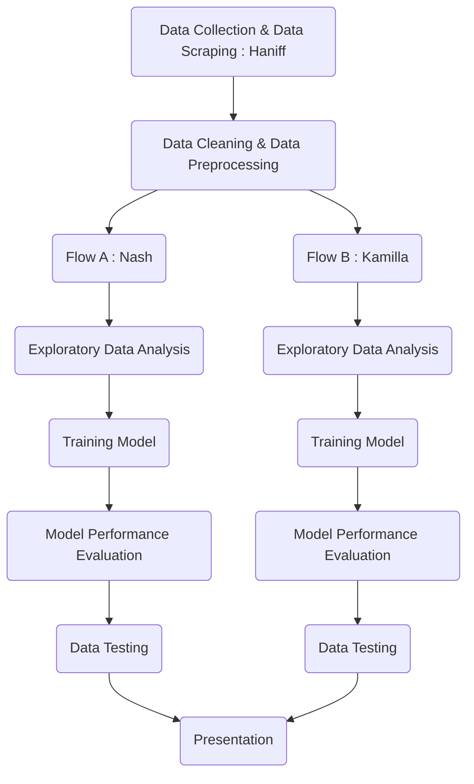

<a name="readme-top"></a>

  <h1 align="center"><a href="https://github.com/HaniffZaid/KoNoHa-Property.git">
    
  </a>

  HOUSE PRICE PREDICTION IN KUALA LUMPUR</h1>
   <h2><p align="center">
     Produced by KONOHA HOLDINGS
   <p align="center">[ Kamilla Halil, Nasharuddin Ghazali & Haniff Zaid ]</p>
   </p></h2>

  <!-- TABLE OF CONTENTS -->
<details>
  <summary>Table of Contents</summary>
  <ol>
    <li><a href="#background-of-the-project">Background of the Project</a>
      <ul>
        <li><a href="#methodology">Methodology</a></li>
        <li><a href="#project-location">Project Location</a></li>
      </ul>
    </li>
    <li><a href="#team-structure">Team Structure</a></li>
    <li><a href="#problem-statement--objectives">Problem Statements & Objectives</a></li>
    <li><a href="#flowchart">Flowchart</a></li>
    <li><a href="#schedule">Schedule</a></li>
    <li><a href="#future-improvements--applications">Future Improvements & Applications</a></li>
    <li><a href="#contact">Contact</a></li>
    <li><a href="#acknowledgement">Acknowledgement</a></li>
  </ol>
</details>


<!-- BACKGROUND OF THE PROJECT -->
## Background of The Project

KONOHA Holdings has been tasked to produce a house price prediction model within a week. After some quick research, we decided to focus on datasets available in Federal Territory of Kuala Lumpur. House price prediction model is expected to **HELP BUYERS** i.e. people who plan to buy a house so they can know the price range in the future, then they can plan their finance well. In addition, house price predictions is also beneficial to **HELP SELLERS** i.e. property investors to know the trend of housing prices in a certain location.

<!-- METHODOLOGY -->
### Methodology

We divide the methodologies into four phases which are:

| Phase 1: PLANNING | Phase 2: DATA PREPARATION | Phase 3: ML MODELLING | Phase 4: DEPLOYMENT |
| ------------- | ------------- | ------------- | ------------- |
| 1. Define goals | 5. Get data | 9. Create model | 13. Present Model |
| 2. Organize resources | 6. Clean data | 10. Validate model | 14. Deploy model |
| 3. Coordinate team | 7. Explore data | 11. Evaluate model | 15. Modify model |
| 4. Schedule project | 8. Refine data | 12. Refine model | 16. Model maintenance |

However, we can only proceed until step 13 for this bootcamp group presentation. Step 14 onwards is for future improvements.   

<!-- PROJECT LOCATION -->
### Project Location

```geojson
{
  "type": "FeatureCollection",
  "features": [
    {
      "type": "Feature",
      "properties": {},
      "geometry": {
        "coordinates": [
          [
            [
              101.61866004946938,
              3.2256216237932307
            ],
            [
              101.61866004946938,
              3.101070592555459
            ],
            [
              101.78437953118771,
              3.101070592555459
            ],
            [
              101.78437953118771,
              3.2256216237932307
            ],
            [
              101.61866004946938,
              3.2256216237932307
            ]
          ]
        ],
        "type": "Polygon"
      }
    }
  ]
}
```
<p align="center">Federal Territory of Kuala Lumpur</p>
<p align="right">(<a href="#readme-top">back to top</a>)</p>

<!-- TEAM STRUCTURE -->
## Team Structure


<p align="right">(<a href="#readme-top">back to top</a>)</p>

<!-- PROBLEM STATEMENTS & OBJECTIVES -->
## Problem Statement & Objectives

In a house price prediction model project, the common problem statements typically revolve around understanding and predicting the value of residential properties based on various features. Here are the problem statements that we encounter:

1. **Predicting House Prices**:
   - *Problem Statement:* "Given a dataset with various features of houses (such as size, location, number of bedrooms, etc.), predict the selling price of a house."
   - *Objective:* Develop a predictive model that accurately estimates house prices based on input features.

2. **Feature Importance Analysis**:
   - *Problem Statement:* "Determine which features (e.g., number of bedrooms, location, square footage) are the most influential in predicting house prices."
   - *Objective:* Identify and rank the importance of different features to understand what drives house prices.

3. **Price Estimation for Different Locations**:
   - *Problem Statement:* "Estimate house prices for properties in different geographical areas, taking into account varying market conditions and local characteristics."
   - *Objective:* Create a model that can account for regional differences in housing prices and provide accurate estimates for various locations.

4. **Handling Missing Data**:
   - *Problem Statement:* "Address and handle missing or incomplete data in the housing dataset to improve the accuracy of the price prediction model."
   - *Objective:* Implement strategies to manage missing values and ensure that the model can still make reliable predictions.

5. **Model Comparison**:
   - *Problem Statement:* "Compare the performance of different regression algorithms (e.g., linear regression, decision trees, random forests) in predicting house prices."
   - *Objective:* Evaluate and compare the effectiveness of various machine learning models to identify the best-performing approach for price prediction.

6. **Addressing Outliers**:
   - *Problem Statement:* "Identify and manage outliers in the housing dataset that may distort the predictions of house prices."
   - *Objective:* Develop methods to detect and handle outliers to improve the accuracy and robustness of the predictive model.

7. **Impact of Economic Factors**:
   - *Problem Statement:* "Assess the impact of economic factors (e.g., interest rates, unemployment rates) on house prices and incorporate these factors into the predictive model."
   - *Objective:* Integrate macroeconomic indicators into the model to enhance price predictions and account for broader economic influences.

<p align="right">(<a href="#readme-top">back to top</a>)</p>


<!-- FLOWCHART -->
## Flowchart


<p align="right">(<a href="#readme-top">back to top</a>)</p>


<!-- SCHEDULE -->
## Schedule

|  | DAY 1 | DAY 2 | DAY 3 | DAY 4 | DAY 5 | DAY 6 | DAY 7 | DAY 8 |
| ------------- | ------------- | ------------- | ------------- | ------------- | ------------- | ------------- | ------------- | ------------- |
| ITEMS | 17/08/24 | 18/08/24 | 19/08/24 | 20/08/24 | 21/08/24 | 22/08/24 | 23/08/24 | 24/08/24 | 
| Data Collection and Scraping | H | 
| Data Cleaning and Preprocessing |  | H | H |
| Exploratory Data Analysis |  |  |  | KN |
| ML Data Modelling |  |  |  |  | KN |
| Model Performance Evaluation |  |  |  |  |  | KNH | KNH |
| Presentation |  |  |  |  |  |  |  | KNH |

K = Kamilla Halil, N = Nasharuddin Ghazali, H = Haniff Zaid

<p align="right">(<a href="#readme-top">back to top</a>)</p>

<!-- FUTURE IMPROVEMENTS & APPLICATIONS -->
## Future Improvements & Applications

Improving house price prediction models with machine learning is an ongoing area of research and development. We suggest some promising future improvements:

1. **Feature Engineering and Selection**:
   - **More Granular Features**: Incorporating detailed features such as neighborhood amenities, local school ratings, or future infrastructure plans.
   - **Temporal Features**: Integrating time-based features to capture trends and seasonal variations in the housing market.
   - **Interaction Terms**: Exploring interactions between different features to capture complex relationships.

2. **Data Quality and Quantity**:
   - **Enhanced Data Collection**: Using more comprehensive datasets, including satellite imagery, social media sentiment, and economic indicators.
   - **Data Augmentation**: Leveraging synthetic data or data from related domains to improve model robustness.
   - **Better Data Cleaning**: Improving preprocessing techniques to handle missing values, outliers, and data inconsistencies.

3. **Advanced Model Architectures**:
   - **Ensemble Methods**: Combining multiple models (e.g., gradient boosting, random forests) to improve prediction accuracy.
   - **Deep Learning**: Employing neural networks, such as convolutional neural networks (CNNs) for spatial data or recurrent neural networks (RNNs) for temporal data.
   - **Hybrid Models**: Combining traditional statistical methods with machine learning techniques for better performance.

4. **Explainability and Interpretability**:
   - **Model Transparency**: Developing models that provide insights into how predictions are made, which helps in understanding and trust.
   - **Feature Importance**: Providing clear explanations of which features are driving the predictions.

8. **User Personalization**:
   - **Customized Recommendations**: Tailoring predictions based on user-specific preferences or past behavior.
   - **Interactive Tools**: Developing interfaces that allow users to explore different scenarios and their impacts on house prices.

Implementing these improvements requires a combination of better data, advanced modeling techniques, and ongoing evaluation to adapt to evolving market conditions.

<p align="right">(<a href="#readme-top">back to top</a>)</p>


<!-- CONTACT -->
## Contact

1. Kamilla Halil - [Github](https://github.com/kameerahariru)

2. Nasharuddin Ghazali - [Github](https://github.com/Nash887)

3. Haniff Zaid - [LinkedIn](https://www.linkedin.com/in/HaniffZaid) - [Github](https://github.com/HaniffZaid) - [Gmail](mailto:anipzaid@gmail.com)

   - Project Link: [Github](https://github.com/kameerahariru/KoNoHa-Property.git)

<p align="right">(<a href="#readme-top">back to top</a>)</p>


<!-- ACKNOWLEDGEMENT -->
## Acknowledgement

We want to express our appreciation to our Data Science Bootcamp trainer, Dr. Fairoza Amira Binti Hamzah, for all the knowledge she has taught us from the start till the end of the bootcamp. We hope to gain much more knowledge by joining her team in the future. May Allah bless her with success, health, happiness, patience and strength, amin.

Dr. Fairoza Amira - [Github](https://github.com/FairozaAmira) - fairozaamira@gmail.com

<p align="right">(<a href="#readme-top">back to top</a>)</p>
